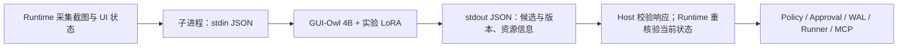

# 本地模型、API 与 GUI 协作设计

English: [Design companion](en/local-model-api-gui-routing-design.md)

> 整理于 2026-09-29，依据 2026-09-10 / 2026-09-17 的三次设计讨论。
> 状态：设计参考与后续验收要求。候选模型、常驻 API 和混合路由尚待各自实验验证。
> [PROJECT_STATUS.md](../PROJECT_STATUS.md) 决定唯一活动目标；
> 本文不激活模型运行、Serving、云端调用或 Runtime 改动。

## 与现有任务的关系

| 设计内容 | 现有任务 | 后续需要的证据 |
|---|---|---|
| 本地 VLM 候选选择 | MM-003 | 加载、processor、独立 Adapter 重载、固定任务质量和显存 |
| 推理契约与本机 API | SERV-001 | worker/API 候选一致性、错误处理、观察绑定与资源限制 |
| 前缀缓存与常驻模型 | SERV-004 | cache hit、冷/热启动、P50/P95、常驻显存 |
| GUI 总成本与时延 | SERV-010 | 固定 A/B/C 对照、每成功任务成本、端到端耗时 |
| 分层路由与升级 | SERV-012 | 本地覆盖率、成功率、升级/恢复条件与安全回归 |

详细要求写在[任务清单](../AI_Infra_LLM_Agent_待做任务清单.md)的对应条目中。
这些对应关系不是执行顺序；启动条件仍由项目状态决定。

## 现有能力与证据边界

当前 GUI 实验使用[本地 Word worker](../scripts/probe_gui_owl_word.py)
和[候选动作适配器](NATIVE_GUI_PROPOSAL_ADAPTER_V1.md)。链路为：



Runtime 通过 `subprocess.run()` 启动 worker；一次加载、推理后退出。
`request_id`、`context_digest`、截图摘要、模型 revision 和 Adapter 摘要
把结果绑定到对应请求与观察。摘要相等不证明观察真实性，也不提供动作权限。

| 已有证据 | 能证明什么 | 不能据此宣称什么 |
|---|---|---|
| [GUI-Owl LoRA pilot](GUI_OWL_LORA_PILOT_V1.md)：17/24，门槛20/24 | 固定样例上的改进与未通过的准入项 | 模型已获通用 GUI 准入 |
| 2026-09-07 [固定 Word 记录](https://github.com/kuoforever/guarded-desktop-agent/blob/222136403388ca8373de716142bff6a2ad39e99e/docs/GUI_WORD_CONTINUOUS_EVIDENCE.md)：写入、保存、新进程重开通过 | 一次合成文本、受控流程的应用诊断 | 模型自主规划/撰写全文，或跨应用成功率 |
| [MM-004](MM-004-multimodal-hard-negative-model-evaluation-result-review-v2.md)：32/56，clean accept 4/28，hard-negative rejection 28/28 | 固定成对样例中的明显 reject bias | 混合路由已经可靠、省钱或更快 |

固定 Word 的 2.297 秒仅为 generation time，不含加载和桌面操作。
该任务中模型主要定位编辑区，内容、保存和结果核验由 Host/Runtime 编排。

Runtime 的 [local_openai 边界](https://github.com/kuoforever/guarded-desktop-agent/blob/222136403388ca8373de716142bff6a2ad39e99e/docs/PROVIDERS.md)
是另一条文本 Planner/final 接入路径：仅接受指定 loopback `/v1` 地址，
不启动模型服务，未开放视觉或普通 native tool calling。
`base_url` 配置不能替代上述 GUI 视觉 worker 集成。

## 本地模型候选

以下保留 2026-09-17 的选型假设，不作为最新型号清单或本机测量结果。
当时核对的机器为 RTX 4090 Laptop（16,376 MiB 显存）、约64GB RAM。

| 候选 | 讨论中的用途 | 需要独立验证的条件 |
|---|---|---|
| `Qwen/Qwen3.5-4B` post-trained | 图文训练、评测和迭代的首个候选 | 短上下文/受限图像推理，再验证 QLoRA、保存与 fresh reload |
| `Qwen/Qwen3.5-9B` 4-bit | 推理能力对照 | 量化质量、图像/KV cache余量、冷启动与常驻成本 |
| 当时讨论的更大模型，包括 Qwen3.8-27B | 后续容量探索 | 官方型号、许可证和支持矩阵重新核实；不作为16GB单卡训练默认项 |

选择4B的依据是完整 `train → save → fresh reload → eval` 循环的空间。
显存预算必须包含权重、视觉输入、KV cache、训练激活和运行时开销。
加载成功只关闭兼容性问题，不能替代任务质量或可训练性验证。

冻结的 Qwen2.5-VL 基线和 Adapter 保留原版本。新模型须独立验证 loader、
processor、LoRA targets/config、输出解析、峰值显存和固定任务指标；
不得假定 Qwen2.5-VL Adapter 可用于 Qwen3.5，也不重写既有实验结果。
恢复选型时核实[4B模型页](https://huggingface.co/Qwen/Qwen3.5-4B)、
[9B模型页](https://huggingface.co/Qwen/Qwen3.5-9B)及框架支持。
官方 benchmark 与本项目成功率分开记录。

## 从 worker 到本机 API

先冻结现有推理契约，再在保持 Transformers + PEFT 实现的前提下增加
loopback 常驻服务。服务负责模型加载、版本、推理超时与资源管理；
Runtime adapter 负责响应校验、当前观察绑定和候选编译。
vLLM 是可选后续后端，GUI-Owl + LoRA 兼容性尚未验证。

| 拟议接口 | 职责 |
|---|---|
| `GET /readyz` | 报告模型与 Adapter 是否完成加载 |
| `GET /v1/model-info` | 报告模型/Adapter身份、支持输入与任务类型 |
| `POST /v1/gui/proposals` | 消费有观察绑定的请求，返回候选与推理指标 |

契约应保留 `request_id`、`context_digest`、截图摘要、模型 revision、
Adapter摘要及输入/输出 token、generation time、peak memory 信息。
schema 与版本策略在实现前单独冻结；上述路径只是设计，尚无服务可调用。

第一轮验收保持模型、Adapter、固定输入和生成配置一致，比较原 worker 与
API 的候选结果；同时覆盖超时、错误/不完整响应、观察已过期及资源上限。
API 响应成功后，Runtime 仍须重新核验当前界面。推理重试不授予 GUI
写入/保存重放权限，也不能重启已消费的一次性实验。

服务化的性能收益来自模型常驻减少重复加载；HTTP本身不会使生成变快。
报告须分开计算加载、排队、生成、桌面等待和验证时间，并记录常驻显存代价。
完整跨仓职责见 [Desktop Runtime 集成](../Desktop_Runtime_依赖与集成.md)。

## GUI 路由与协作

| 工作 | 优先承担者 | 条件 |
|---|---|---|
| 控件读取、窗口/文件检查、状态比较 | UIA、规则、确定性工具 | 可直接验证 |
| 熟悉界面中的窄范围定位/动作候选 | 已验证的本地模型 | 目标唯一、观察新鲜、有独立验收 |
| 陌生界面、复杂语义、跨页面规划 | 云端模型 | 可直接路由，避免无效本地前置尝试 |
| 歧义、观察冲突、无进展后的重规划 | 云端模型 | 携带新状态与失败证据 |
| 授权、执行、恢复、结果验证 | Runtime | 所有模型共用同一执行边界 |

协作单位包含子目标、前置条件、成功条件、停止条件和步数预算。
连续 GUI 工作基于最新观察重新定位；不把模型自报 confidence 当作路由依据。
本地覆盖率和被路由任务的实际成功率必须在独立验证集上一起测量。
Runtime 拒绝不能靠换模型绕过。

GPT / Claude 先在同一任务集上比较主力与有条件备用，不默认每步双调用。
稳定规则、工具、流程置于 Prompt Caching 前缀，动态输入和界面状态置于后缀；
命中条件、有效期、写入/输出费用须按实际供应商和模型重新核实。
成功流程可沉淀为带状态检查的模板；训练标签需独立验证，
真实富轨迹采集仍按 Lane B 的同意、脱敏、留存与删除规则处理。

## 固定 A/B/C 验证设计

| 组 | 方案 | 回答的问题 |
|---|---|---|
| A | 缓存与上下文优化后的全云端 | 有竞争力的参照成本和时延是多少 |
| B | 云端规划 + 本地确定性流程 | 去除可避免的模型调用能带来多少收益 |
| C | B + 本地小模型与升级路由 | 小模型是否还有增量价值 |

固定任务、初始状态、Runtime、验收方法及资源条件。
先看 B 相对 A，再看 C 相对 B，分别报告冷/热启动。
报告 task success、错误副作用、P50/P95 end-to-end latency、
escalation、retry、human intervention、本地覆盖率和资源占用。

简化模型为 `T_hybrid ≈ T_local + q × T_cloud`，q为仍需升级的比例；
它省略了额外规划、GUI等待和失败恢复，不能替代端到端测量。
MM-004 的合法样例中24/28未接受；若全部升级，会得到约86%的推算比例。
这只展示 reject bias 的风险，不是生产流量的升级率。

```text
每成功任务成本 =
全部尝试的 API、本地算力、冷启动、恢复与人工成本
/ 通过独立状态验证的任务数
```

成功数为零时该指标无定义，须连同全部失败成本报告。
模型升级须同时满足质量、安全和性能要求；不能只以生成时间或API账单验收。

## 讨论来源与续接

| 原始聊天标题 | 日期 | session ID |
|---|---|---|
| 本地模型的API设计 | 2026-09-10 | `01a08956-9997-7831-8721-33c00484f634` |
| QWEN最新小模型评审 | 2026-09-17 | `01a0acf4-5605-7f01-9c4d-b23b63422865` |
| 本地与云端模型协作 | 2026-09-17 | `01a0ad13-3340-7443-9c52-f39ac27c4fc2` |

三次讨论均为调研/设计，未产生新的模型实验或部署结果。
本文归入项目设计资料，既有代码与指标仍引用各自原始证据。
继续工作前核对实际工作树、未提交修改与其 PROJECT_STATUS；
不同工作树的状态不能拼成当前任务。Runtime 工作以它自己的状态文件为准。
